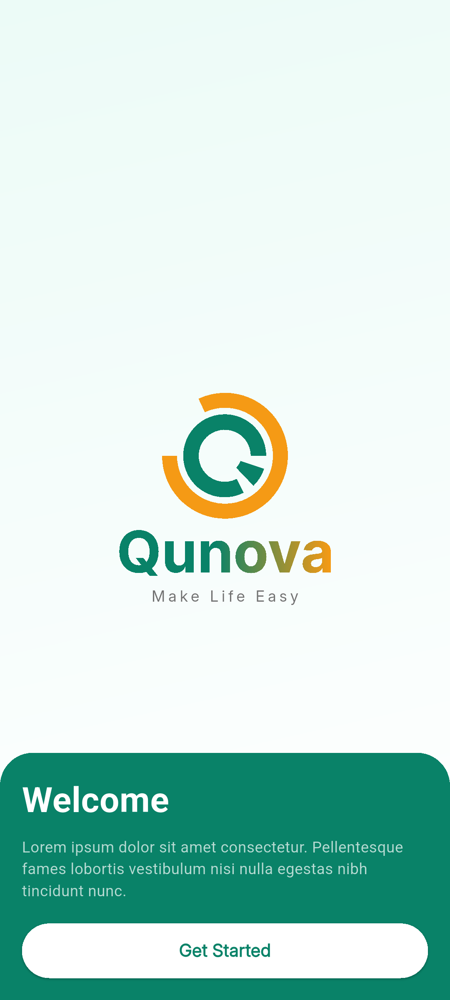
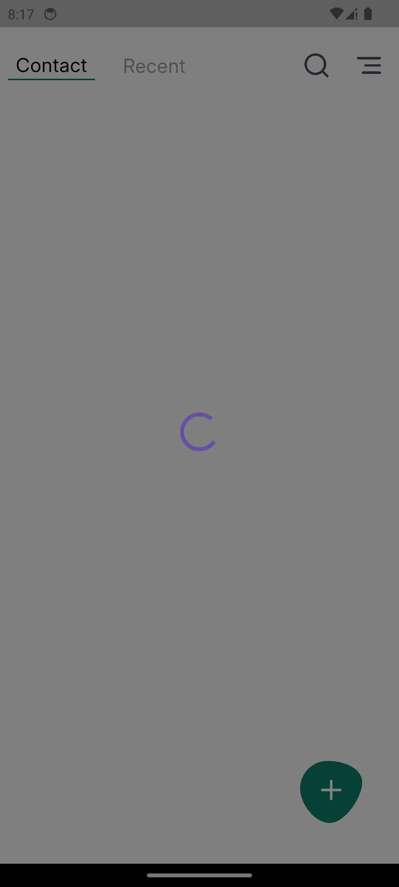
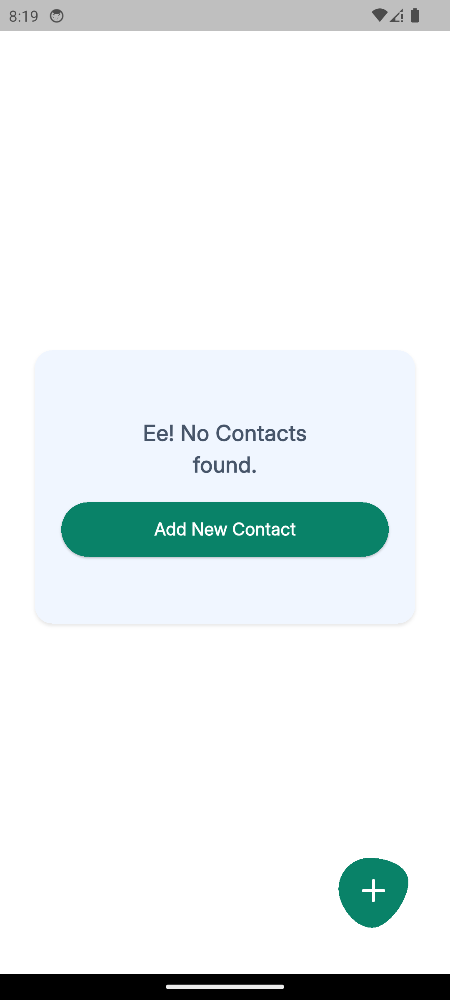
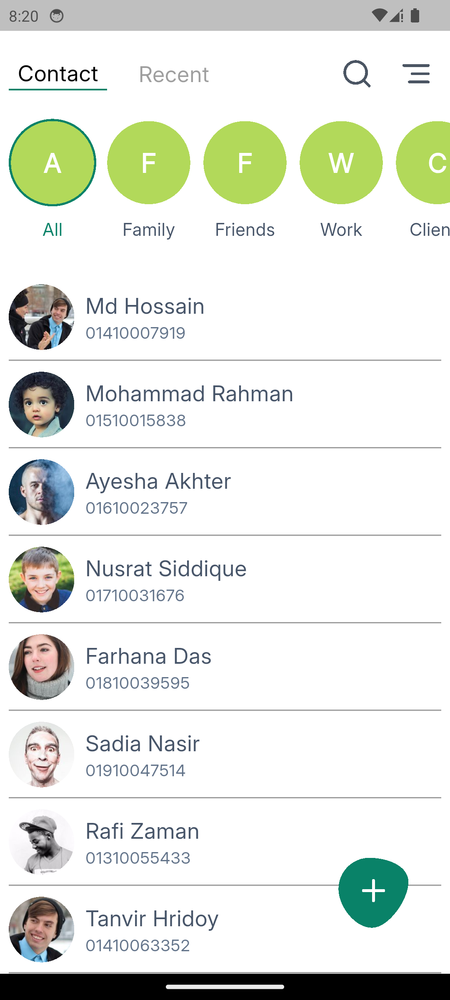
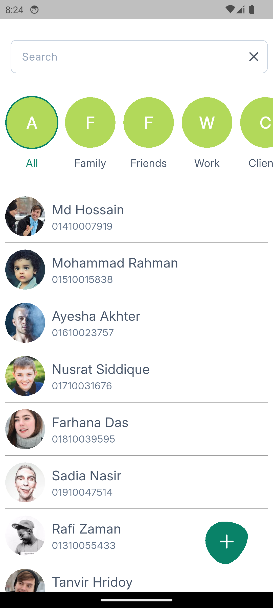
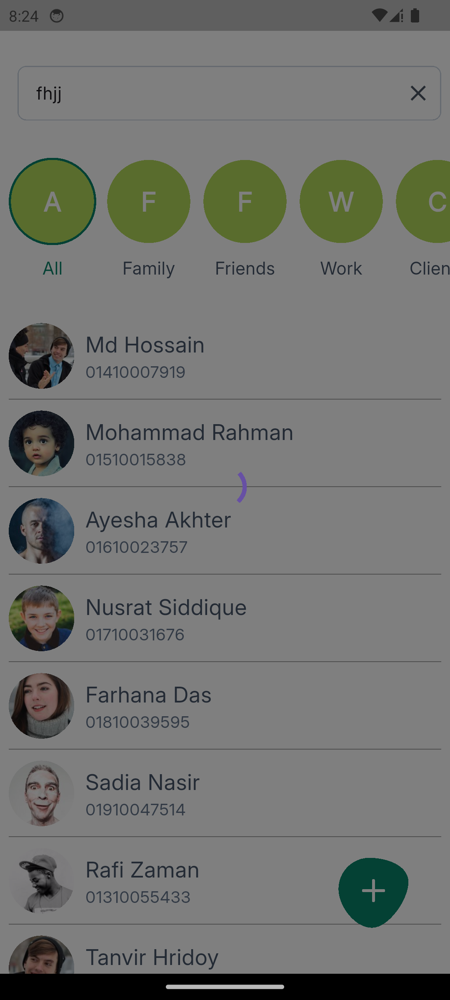
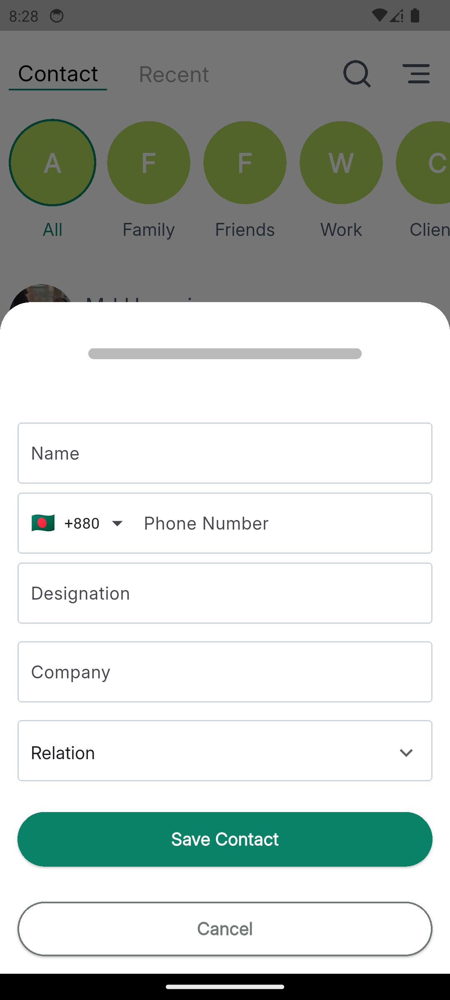
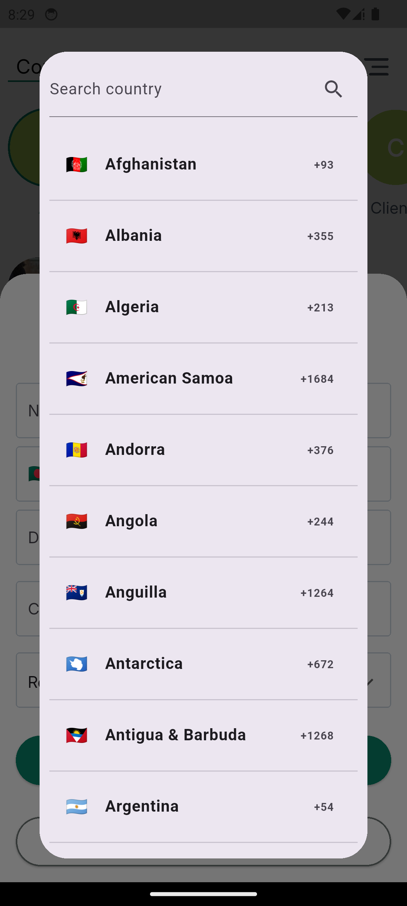

# Contact App

## Table of Contents
* [ Features](#-features)
* [Useful Links](#-useful-links)
* [Current Limitations](#current-limitations)
* [Technical Details](#-technical-details)
    * [Library Used](#used-libraries)
    * [Setup, Flutter Version and Running the app](
        #setup-flutter-version-and-runing-the-app
    )
* [Screenshots](#-screenshots)

---

## ✨ Features

* **Splash** and **Onboarding Screen**
* **Contact View** : Read all contact, read by category
* **Search Contact** : Search by category and name
* **Create Contact** : UI created but functionality not implemented yet

---

## 🔗 Useful Links

| Description       | Link                            |
|:------------------|:--------------------------------|
| **Video Preview** | \[https://youtu.be/gZka3n9K2rY] |
| **APK Download**  | \[download the `android-release.apk`from this current directory]                     |
| **Latest Code and App**   | \[ checkout to the `dev` branch]  |
---

### Current Limitations

**Emulator Display:** In some emulators (e.g., macOS Android Emulator), the **shadows for dialogs and bottom sheets** may not display correctly, though they work fine on physical devices.

Currently, for read by category and search the API provides all contacts regardless of the query parameter. Either there is an issue with the API or the parameter name was misunderstood. However, all implementations are done, and this can be a quick fix

---

## 💻 Technical Details
Soon, different branches will be available that uses a different state management solution to measure and identify the differences between performance, scalability, and maintainability
### Used Libraries
- **RxDart**: for reactive programming
- **Intl Phone Field**: for phone number text field with country flag 
- **Http**: for network IO
- **GetX**: to manage single source of truth for snackbar and primary state management
- **Shared Prefence** : keep data about onboarding screen is shown or not so that onboarding screen show during the first time app installation
- **Flutter SVG**: to show the SVG from Figma as Icon
### Setup, Flutter Version and Runing The App
- **Flutter and Dart Version**: **Flutter 3.32.0 SDK** & **Dart 3.8.0**
- **Run**: Download the apk or use Flutter run command

---
## 📸 Screenshots

### **Splash Screen**

### **Onboarding Screen**

### **Contact Screen**

Note: If for a contact or category image does not exits show a placeholder and if for any contact name does not exits, UI ignore them

### **Search**

Note: on dismiss search it reload the data.

### **Create Contact**

